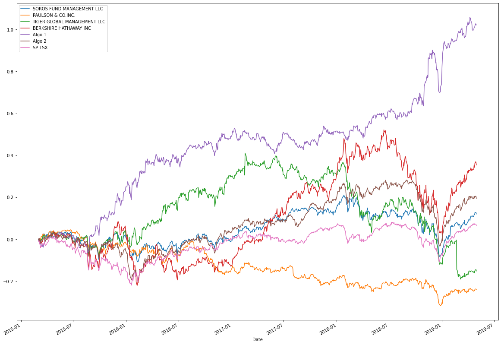

# Unit-4-Homework
Fintech bootcamp homework unit 4, Pandas and financial portfolio analysis.
The notebook for this repository is analysis and comparison of algorithmic trading strategys to that of large investment firms. The latter half of the notebook repeats the analysis for stocks picked as a growth portfolio in the australian stock market. The image below shows the cumulative product between 2015-2019 from strategies that were analysed herein.

## Analysis
### Determine whether the algorithmic strategies outperform both the market (S&P TSX 60) and the managed portfolios.
---

### Algo 1

##### Risk:
Algo 1 has an annual standard deviation 0.1204 (7.89% above the SP TSX), making this strategy the second least volatile in comparison to all other strategies that have been analyzed. Aside from the SP TSX, Algo 1 was the only other profile to display cumulative returns as outliers on the boxplot (see cell [18]), this in combination with the longest whiskers indicate a non-normal or multimodal distribution of the data.

##### Correlation:
The strategy behind Algo 1 displays minimal correlation with regard to the broader market, additionally, Algo 1 is the only strategy to display a significantly negative correlation to the SP TSX (see cell [21]), the heatmap seen in cell [22] displays low correlation to all other stategies. 

##### Returns:
For the given window of data, Algo 1 outperformed all funds, with a final return of 102.2% in the 2015 - 2019 period.

##### Sharpe ratio:
Algo 1 has a sharpe ratio of 1.49, placing it firmly above all other funds.

---

### Algo 2

### Risk:
Algo 2 has an annual standard deviation of 0.1321 (18.37% above the SP TSX), making this strategy the third most volatile in comparison to all other strategies that have been analyzed (see cell [19]). Algo 2 also displays a relativly tight range of cumulative returns in the boxplot.

### Correlation:
Algo 2 correlates quite closely to the broader market and follows many of the peaks and troughs seen by the managed funds (see cell[21]).
### Returns:
For the given window of data, Algo 2 outperformed all other managed funds, with a final return of 19.5% in the 2015 - 2019 period.
### Sharpe ratio:
Despite solid returns, the sharpe ratio for Algo 2 was 0.40, which falls somewhere between Birkshire Hathaway and the SP TSX. Although the strategy provided higher than average returns for this period, it may be subject to market influences and may see different perfomance depending on external factors.

---

## Australian portfolio

### Risk:
My portfolio has an annual standard deviation 0.2844 (156.4% above the SP TSX), making this portfolio the most volatile in comparison to all other strategies that have been analyzed.

### Correlation:
This portfolio has an overall correlation to the SP TSX 60 of 0.19 (see cell [39]), making it the least correlated of all profiles, much like Algo 1, the portfolio displays negative values on the 21 day rolling correlation (cell [40]) and the 60 day rolling beta (cell [41]).

### Returns:
My portfolio had returns of 40.1% in the 2015 - 2019 period, placing it between Algo 1 and Algo 2 for total returns.

### Sharpe ratio:
A sharpe ratio of 0.91 (cell [42]) demonstrates an acceptable return considering the above average risk profile for this portfolio. 

---
### Discussion:
Based on the data above, Algo 1 and Algo 2 both outperformed the managed funds with regard to overall yeild, with Algo 1 displaying exceptional results. However, this is not without saying, some assumptions have been made about the equivalence of the funds being managed as factors like trading volume and regulations have not been accounted for.

Overall, the Australian stock portfolio displayed good returns, and low correlation to the market, however, the low correlation may be due to the comparison of australian stocks with the canadian stock index. The high risk nature of the profile may be unreasonable for particular applications but could be suggested as a good start for a growth portfolio.

Note: there are slight variations between the datasets from the initial analysis and after 'My_folio' was added, this may be due to missing data being dropped during data processing. Although the data is similar in values, observations made before and after are not 100% comparable.

---